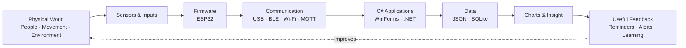
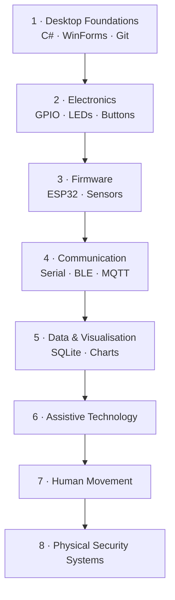

# Code Meets Reality

> **Building software that senses, communicates with, and improves the physical world.**

`Code Meets Reality` is my engineering learning hub and portfolio map.

It connects my experience and interests in software engineering, healthcare, human movement, karate, guitar, accessibility, and physical-security systems through practical projects that cross the boundary between software and hardware.

---

## System vision



The long-term goal is to understand the complete path:

```text
physical event → sensor → firmware → protocol → application → data → useful human action
```

---

## Current mission

### 🚧 Daily Checker / まいにち安心

A Japanese Windows desktop application designed to support simple everyday routines for an elderly family member.

- **Repository:** [ShinyaWebDev/daily-checker](https://github.com/ShinyaWebDev/daily-checker)
- **Current skills:** C#, WinForms, application structure, JSON, accessibility, Git
- **Next direction:** reliable local persistence, testing, usability refinement, and later integration with a physical “元気です” button

[Read the project page →](projects/daily-checker.md)

---

## Learning journey



[View the full roadmap →](docs/roadmap.md)

---

## Project portfolio

| Project | Real-world purpose | Status | Main learning |
|---|---|---:|---|
| [Daily Checker](projects/daily-checker.md) | Accessible daily support | 🚧 Active | C#, WinForms, JSON |
| [Guitar Humidity Monitor](projects/guitar-humidity-monitor.md) | Protect instruments through environmental monitoring | 🧭 Next | ESP32, sensors, serial/BLE |
| [Medication Reminder](projects/medication-reminder.md) | Explore accessible physical reminders | 💡 Planned | Buttons, lights, protocols |
| [Karate Motion Analyser](projects/karate-motion-analyser.md) | Explore repeatable movement data | 💡 Planned | IMU, sampling, charts |
| [Guitar Practice Pedal](projects/guitar-practice-pedal.md) | Physical control for practice workflows | 💡 Planned | BLE/MIDI, switches |

---

## Knowledge map

| Area | Topics |
|---|---|
| [Desktop](knowledge/desktop/README.md) | C#, .NET, WinForms, SQLite, testing |
| [Embedded](knowledge/embedded/README.md) | ESP32, firmware, GPIO, sensors |
| [Communication](knowledge/communication/README.md) | Serial, BLE, Wi-Fi, MQTT, protocols |
| [Hardware](knowledge/hardware/README.md) | Electronics, components, safe prototyping |
| [Human movement](knowledge/human-movement/README.md) | IMUs, biomechanics, signal interpretation |
| [Security systems](knowledge/security/README.md) | Inputs, relays, events, controllers |
| [Engineering practice](knowledge/engineering/README.md) | Git, testing, architecture, documentation |

---

## How this repository is organised

```text
Code-Meets-Reality/
├── README.md
├── docs/                  # Vision, roadmap, philosophy and current focus
├── projects/              # Project summaries and links to code repositories
├── knowledge/             # Notes organised by engineering domain
├── journal/               # Dated learning reflections
├── decisions/             # Engineering decision records
├── templates/             # Reusable project and experiment templates
├── resources/             # Books, videos, tools and idea inbox
└── assets/                # Diagrams and images
```

Application source code lives in separate repositories. This repository explains how those projects fit together.

---

## Principles

1. **Build small, testable milestones.**
2. **Solve a real problem or create genuine enjoyment.**
3. **Prefer understanding over collecting technologies.**
4. **Document failures as well as successes.**
5. **Treat accessibility, privacy, and safety as engineering requirements.**
6. **Use AI to increase speed without outsourcing judgement.**

[Read the learning philosophy →](docs/philosophy.md)

---

## Latest progress

See the [engineering journal](journal/README.md) and [current focus](docs/current-focus.md).

---

## Repository status

This repository is in its first structured version. It will evolve alongside the projects it documents.
