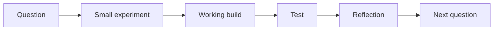

# Learning Philosophy

## Build to understand

Tutorials are useful, but understanding grows when a concept is applied to a working system.

Every learning cycle should include:

## Small milestones

A milestone should be:

- demonstrable
- testable
- reviewable
- small enough to finish
- focused on one or two new ideas

“Build the complete platform” is not a milestone.

“Read one humidity sensor and output validated JSON over serial” is a milestone.

## Real users and real constraints

Projects become meaningful when they consider:

- who will use them
- what mistakes are likely
- how failure is shown
- what data should remain private
- whether the device creates unsafe assumptions
- how the user recovers

## AI as an accelerator

AI agents may:

- inspect repositories
- implement bounded features
- create tests
- refactor
- improve documentation
- run builds

The engineer must still:

- define the problem
- review changes
- understand important logic
- test physical behaviour
- approve dependencies
- make safety and privacy decisions

## Evidence of progress

Progress should be visible through:

- working demonstrations
- Git commits
- project pages
- decision records
- experiment logs
- learning-journal entries
