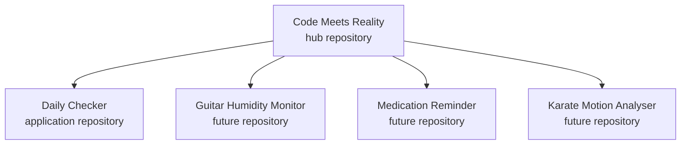

# Repository Model

Code Meets Reality is the portfolio and knowledge hub.

Each substantial application or firmware project has its own repository.

## Why separate repositories?

Each project can have its own:

- source history
- issues
- releases
- build instructions
- dependencies
- CI workflow
- licence
- contributors

The hub repository provides:

- shared vision
- overall roadmap
- knowledge notes
- project catalogue
- learning journal
- decision records
- links to source repositories

## What does not belong here?

- copied application source code
- build outputs
- secrets
- personal health records
- proprietary work code
- confidential employer information
