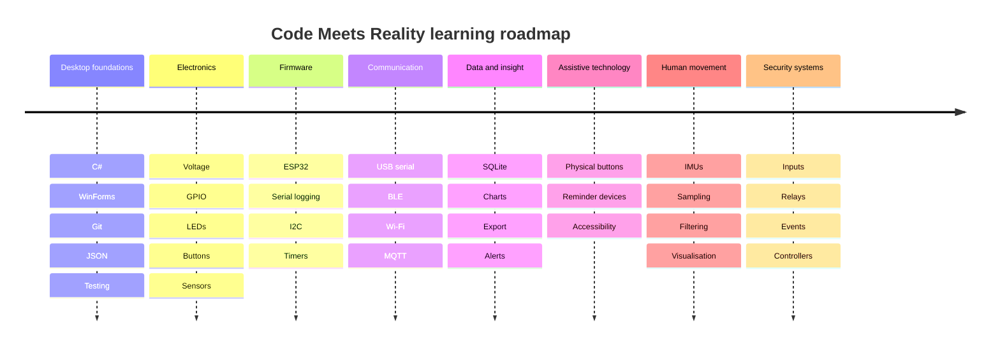

# Roadmap

The roadmap is directional rather than fixed. Each stage should produce a working demonstration before the next stage becomes the focus.

## Stage 1 — Desktop foundations

**Active project:** Daily Checker

Learn:

- modern C#
- .NET and WinForms
- solutions and projects
- models, services, and UI separation
- JSON persistence
- SQLite
- automated testing
- packaging and installation
- accessible Japanese UI

Exit criteria:

- application runs on another Windows computer
- user data survives restart and malformed-file recovery
- important non-UI logic is tested
- intended user can complete the primary workflow

## Stage 2 — Electronics foundations

Experiments:

1. blink an LED
2. read a button
3. control output from input
4. use a buzzer
5. read temperature and humidity

Learn:

- low-voltage safety
- breadboards
- resistors
- digital input/output
- pull-up resistors
- basic measurement with a multimeter

## Stage 3 — Firmware

**Target project:** Guitar Humidity Monitor v1

Learn:

- ESP32 toolchain
- firmware build/upload cycle
- serial logging
- sensor libraries
- I2C
- sampling intervals
- error states
- long-running reliability

## Stage 4 — Communication

Connect firmware to a C# application using:

1. USB serial
2. BLE
3. MQTT only when it solves a real networking need

Learn:

- message framing
- JSON payloads
- validation
- reconnect behaviour
- duplicate messages
- device identity

## Stage 5 — Data and visualisation

Extend a connected project with:

- SQLite history
- trend charts
- thresholds
- CSV export
- calibration notes

## Stage 6 — Assistive technology

Candidate project:

- physical “元気です” button
- medication reminder prototype
- large reminder light
- simple routine board

Priorities:

- accessibility
- privacy
- offline-first behaviour
- visible failure states
- easy recovery

## Stage 7 — Human movement

Candidate project:

- karate technique analyser
- guitar wrist movement tracker
- posture experiment

Learn:

- accelerometers and gyroscopes
- sensor placement
- sampling rate
- filtering
- orientation
- repeatability
- limits of interpretation

## Stage 8 — Physical security concepts

Candidate project:

- door contact and event dashboard
- keypad and access-state simulation
- relay output demonstration
- controller heartbeat monitor

Learn:

- state machines
- event streams
- device protocols
- offline operation
- failure modes
- security boundaries
