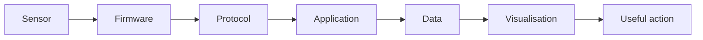

# Vision

## Purpose

Code Meets Reality exists to explore how software interacts with people, devices, movement, environments, and physical systems.

The central question is:

> How can I build reliable software that does more than display information—software that senses, communicates, and supports useful action in the real world?

## Personal connection

This journey brings together experience and interests in:

- software engineering
- nursing and assistive care
- myotherapy and human movement
- karate
- guitar and music
- accessibility
- physical-security systems

These areas are connected by a shared concern: how humans interact with physical systems.

## Long-term capability

The goal is to become comfortable across this chain:

This does not require mastering every layer at once. Each project should deepen one or two parts of the chain.

## What success looks like

Success is not measured by the number of frameworks learned.

It is demonstrated by the ability to:

- define a useful physical-world problem
- build a small reliable prototype
- explain how each layer works
- test failure conditions
- document trade-offs
- improve the design through real use
