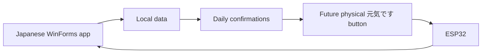

# Daily Checker

**Japanese application name:** まいにち安心  
**Status:** Active  
**Repository:** [ShinyaWebDev/daily-checker](https://github.com/ShinyaWebDev/daily-checker)

## Purpose

Build a simple and accessible Japanese Windows application that supports everyday routines for an elderly family member.

## Why it belongs in Code Meets Reality

Daily Checker begins as desktop software but creates a path toward physical interaction:

## Current learning

- C#
- .NET
- Windows Forms
- Visual Studio
- solutions and projects
- events and controls
- models and services
- local persistence
- accessibility
- Git and GitHub

## Current features observed

- multiple WinForms screens
- task-related forms
- settings
- models and services
- DVD library feature used as a C# learning exercise

## Near-term milestones

- [ ] clarify and document the main product scope
- [ ] confirm storage and recovery behaviour
- [ ] add tests for non-UI logic
- [ ] improve README and run instructions
- [ ] review accessibility with the intended user
- [ ] define a clean physical-button integration boundary

## Future physical extension

A large illuminated “元気です” button could send a local acknowledgement to the application.

This extension should begin only after the desktop workflow is reliable.
