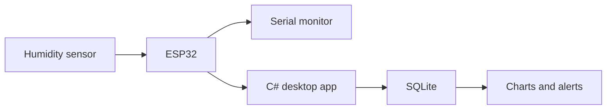

# Guitar Humidity Monitor

**Status:** Next project

## Purpose

Measure temperature and humidity near a guitar or inside its case, then make environmental changes visible over time.

## Architecture evolution



## Milestone 1 — Sensor proof of concept

- [ ] select an ESP32 board
- [ ] select a compatible humidity sensor
- [ ] wire the sensor safely
- [ ] read temperature and humidity
- [ ] validate readings
- [ ] output structured serial data
- [ ] document the wiring

Example payload:

```json
{
  "deviceId": "guitar-monitor-01",
  "temperatureC": 22.4,
  "humidityPercent": 48.2
}
```

## Later milestones

- C# serial receiver
- connection-state UI
- SQLite history
- daily and weekly charts
- configurable thresholds
- optional BLE
- optional display and enclosure

## Limitations

The device provides environmental observations. It cannot guarantee protection from instrument damage.
