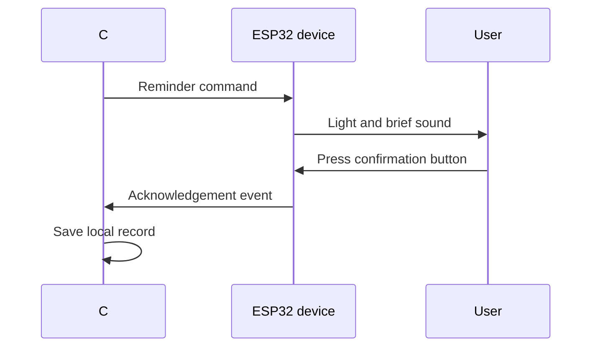

# Medication Reminder

**Status:** Planned

## Purpose

Explore an accessible physical reminder and acknowledgement device connected to a local desktop application.

## Concept

## Safety boundaries

- This is a learning and reminder aid, not a medical device.
- A button press does not prove medication was taken.
- Device or connection failure must be visible.
- It must not dispense medication.
- It must not replace clinical advice or caregiver processes.
