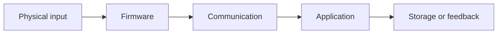

# Project Name

**Status:** Idea / Planned / Active / Paused / Complete  
**Repository:** Add link when created

## Purpose

What real problem does this solve, or what enjoyable physical interaction does it create?

## Intended user

Who is it for?

## Smallest useful version

What is the smallest demonstrable version?

## Architecture

Remove layers that are not needed.

## Milestones

### Milestone 1

- [ ] task
- [ ] task
- [ ] demonstration

## Safety, privacy, and limitations

What must the project not claim or control?

## Testing

### Automated

- test

### Manual

- test

### Physical

- test

## Lessons learned

Add links to journal entries and decision records.
